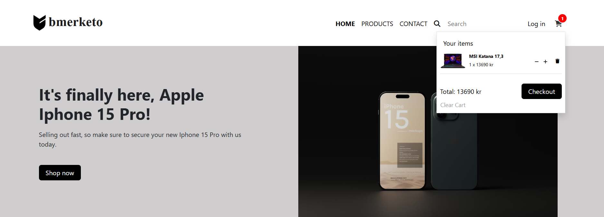

# e-commerce App
A responsive React-based application that allows users to view a list of products, access detailed information, manage a shopping cart, and submit a contact form. The app fetches data from a web API and provides various features for a complete e-commerce experience.

## Features
- **Product Listing**: Displays a list of products fetched from the web API.
- **Product Details**: Users can click on a product to view detailed information such as image, name, description, and price on a separate page.
- **Contact Form**: A form that allows users to submit their name, email address, and a message, with validation to ensure all fields are filled before submission.
- **Feedback Message**: After submitting the contact form, a confirmation message will be shown upon receiving a successful response (status 200) from the API.
- **Shopping Cart**: Users can add and remove products from the cart, which displays the total number of items and the total price.
- **Navigation**: Smooth navigation between pages using React Router.
- **Checkout Page**: Users can go to the checkout page to view their cart, complete their purchase, or modify their cart (add/remove items).
- **Data Management**: The app uses Redux or Context API to manage and store data during the app's usage.

## Technologies Used
**React**: For building the user interface.
**React Router**: For managing navigation between pages.
**Redux and Context API**: For state management and data storage.
**Axios and Fetch**: For interacting with the web API.
**CSS/Styled Components**: For styling the application.

